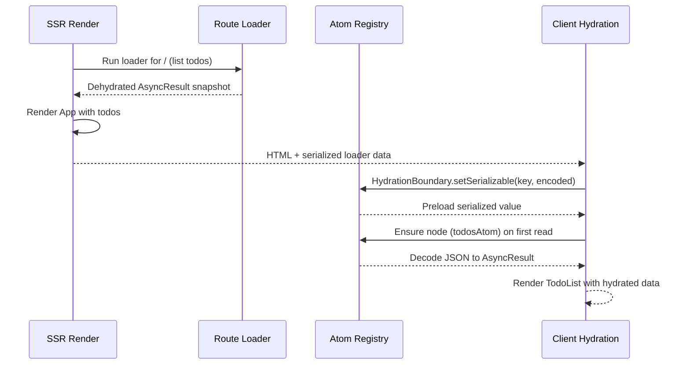

# Hydration Flow

```mermaid
sequenceDiagram
    participant Server as SSR Render
    participant Loader as Route Loader
    participant Registry as Atom Registry
    participant Client as Client Hydration

    Server->>Loader: Run loader for / (list todos)
    Loader-->>Server: Dehydrated AsyncResult snapshot
    Server->>Server: Render App with todos
    Server-->>Client: HTML + serialized loader data

    Client->>Registry: HydrationBoundary.setSerializable(key, encoded)
    Registry-->>Client: Preload serialized value
    Client->>Registry: Ensure node (todosAtom) on first read
    Registry-->>Client: Decode JSON to AsyncResult
    Client-->>Client: Render TodoList with hydrated data
```
