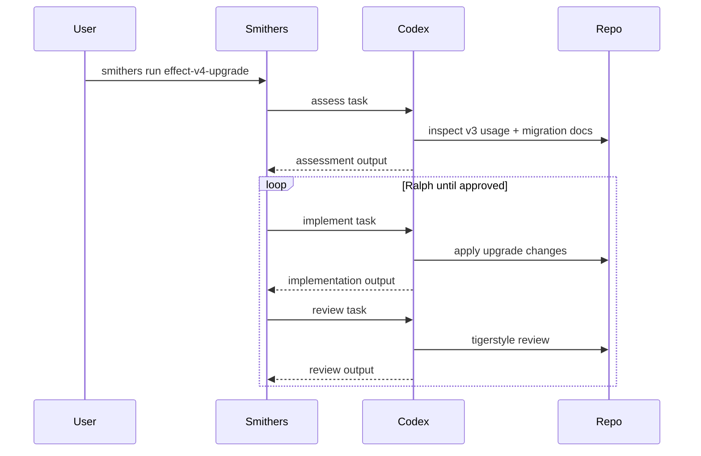

# Workflow Flow

```mermaid
sequenceDiagram
    participant User
    participant Smithers
    participant Codex
    participant Repo

    User->>Smithers: smithers run effect-v4-upgrade
    Smithers->>Codex: assess task
    Codex->>Repo: inspect v3 usage + migration docs
    Codex-->>Smithers: assessment output

    loop Ralph until approved
        Smithers->>Codex: implement task
        Codex->>Repo: apply upgrade changes
        Codex-->>Smithers: implementation output

        Smithers->>Codex: review task
        Codex->>Repo: tigerstyle review
        Codex-->>Smithers: review output
    end
```
