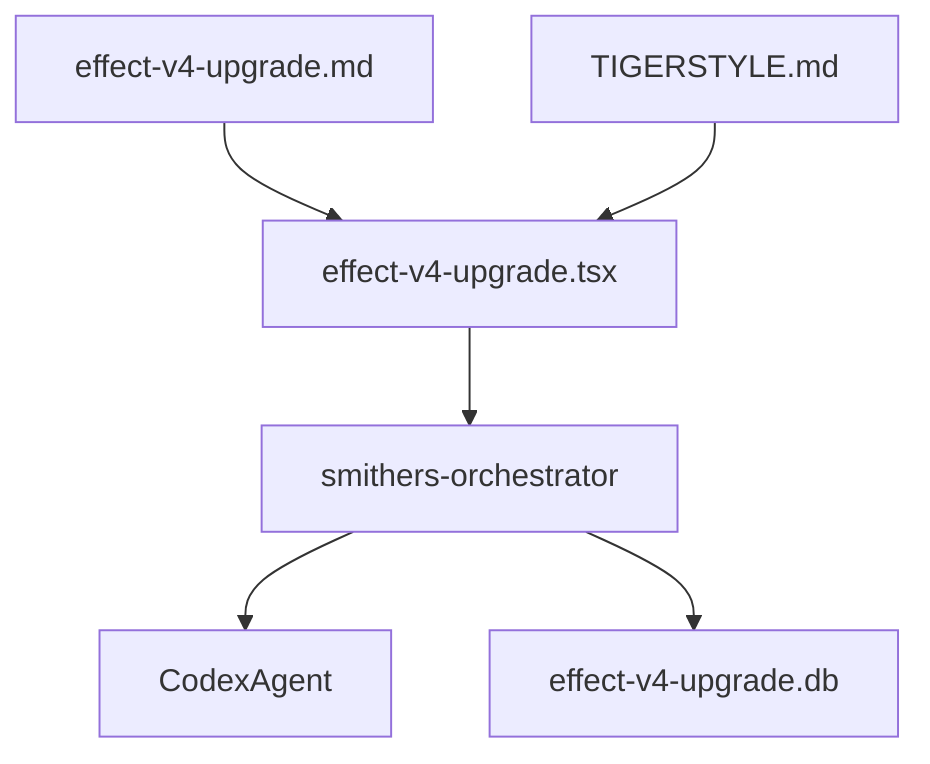

# Workflow Structure

```mermaid
graph TD
    Prompt[effect-v4-upgrade.md]
    Tiger[TIGERSTYLE.md]
    Workflow[effect-v4-upgrade.tsx]
    Smithers[smithers-orchestrator]
    Codex[CodexAgent]
    Db[effect-v4-upgrade.db]

    Prompt --> Workflow
    Tiger --> Workflow
    Workflow --> Smithers
    Smithers --> Codex
    Smithers --> Db
```
